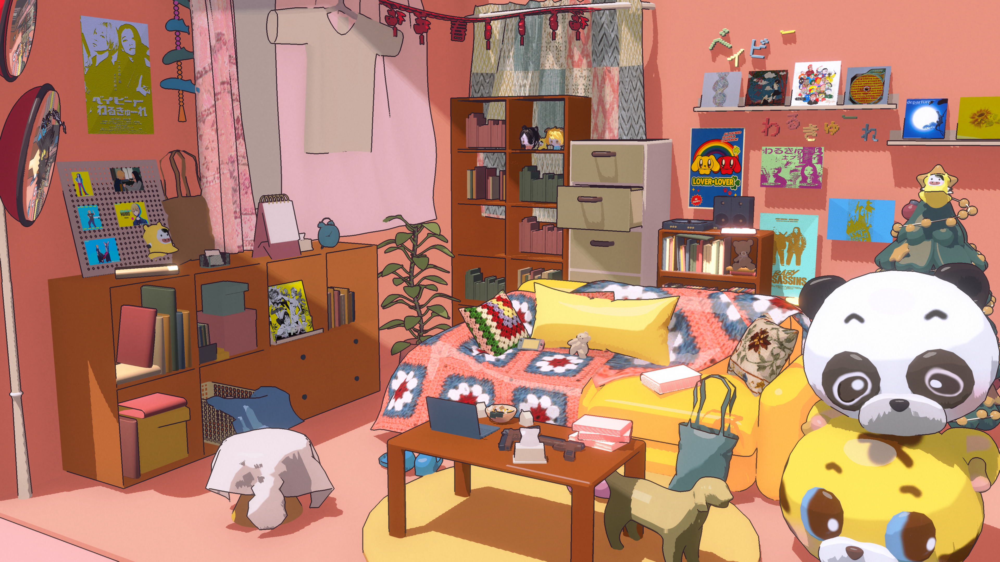
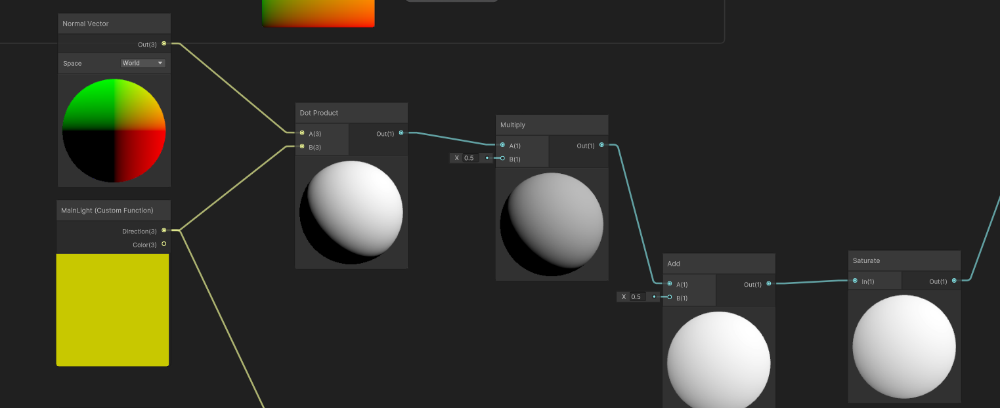
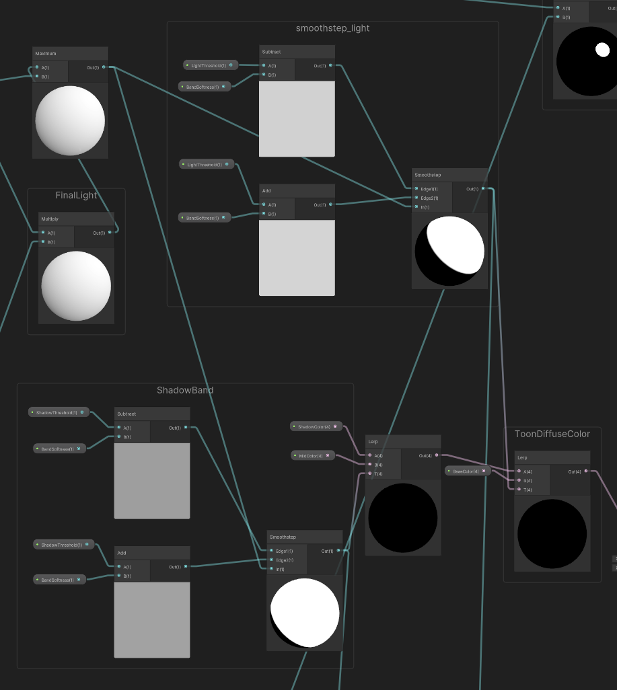
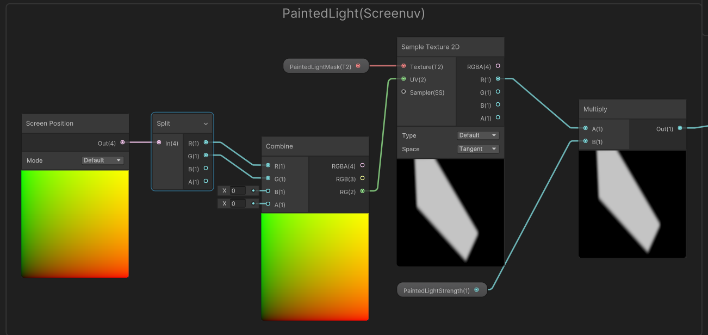
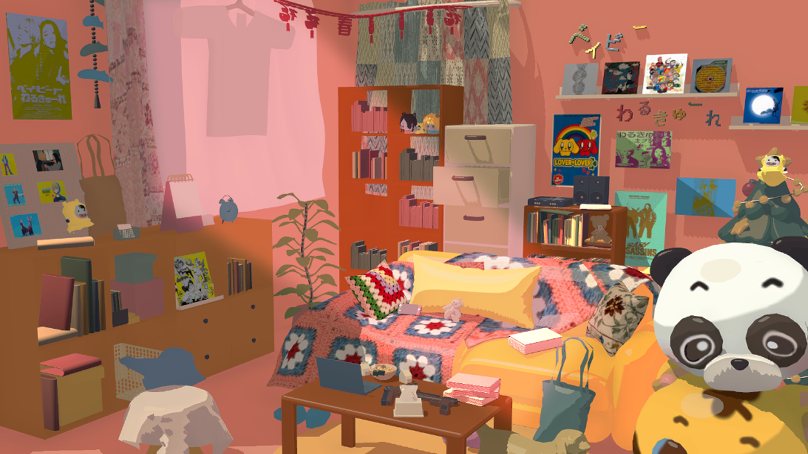

# Stylized NPR Indoor Scene

A stylized real-time indoor scene created in **Unity 2022.3 URP** as a Technical Art portfolio project.

The project focuses on building a cohesive NPR rendering workflow by combining **custom Toon shading, real-time shadows, art-directed lighting, screen-space outlines, materials, and scene lighting**.

## Key Features

- Three-band Toon lighting with artist-controlled Shadow / Mid / Base colors
- Real-time URP main light and shadow integration
- Stylized specular highlights
- Screen-space painted light mask for art-directed lighting
- Depth + Normal based screen-space outlines
- Reusable Toon material workflow
- Scene lighting and final color grading

## Toon Lighting

The core Toon shader uses the surface normal and URP main light direction to calculate **N·L**, which is remapped from continuous lighting into stylized tonal regions.

Real-time shadow attenuation is integrated into the lighting result so that Unity's shadow maps work together with the Toon shading.

The lighting result is divided into three artist-controlled color regions:

**Shadow → Mid → Base**

Threshold and softness parameters provide control over the position and transition of each lighting band, making the shading easier to art-direct across different materials.

## Art-Directed Lighting

To provide additional control beyond physically driven lighting, I implemented a **screen-space painted light mask**.

The mask is sampled using screen-space UVs and combined with the real-time lighting result before the Toon ramp. This allows selected areas of the composition to receive controlled stylized illumination while remaining consistent with the Toon color system.

The painted light texture is shared across Toon materials as scene-level shader data, avoiding repeated per-material setup.

## Screen-Space Outline

The final scene uses a **URP Full Screen Pass** for outline rendering.

Depth discontinuities are used to detect object silhouettes and occlusion boundaries, while normal discontinuities help capture surface transitions that depth alone may miss.

### Without Screen-Space Outline

The screen-space outline pass strengthens silhouettes and object separation across the environment. The final outlined result is shown in the hero image at the top of this page.

## Tools

**Unity 2022.3 · URP · Shader Graph · HLSL · C# · Blender · Photoshop**